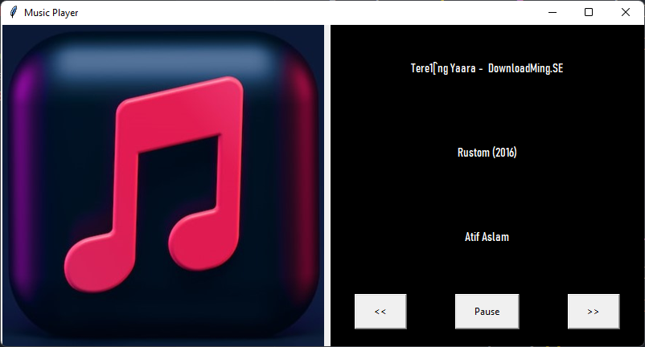
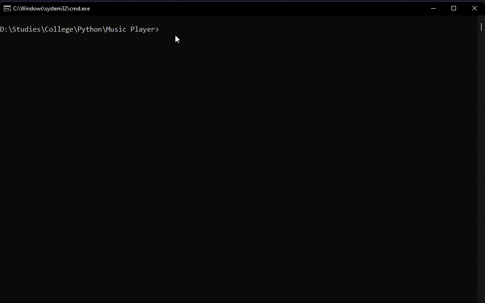
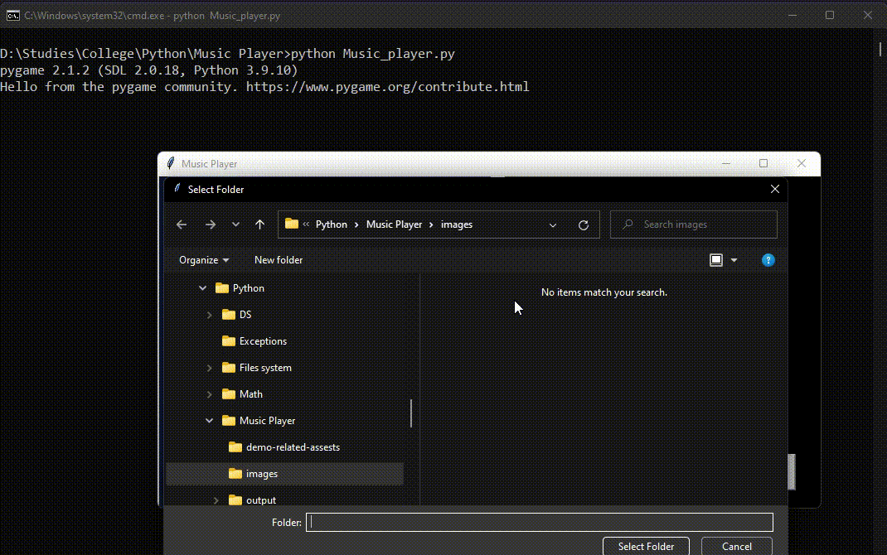
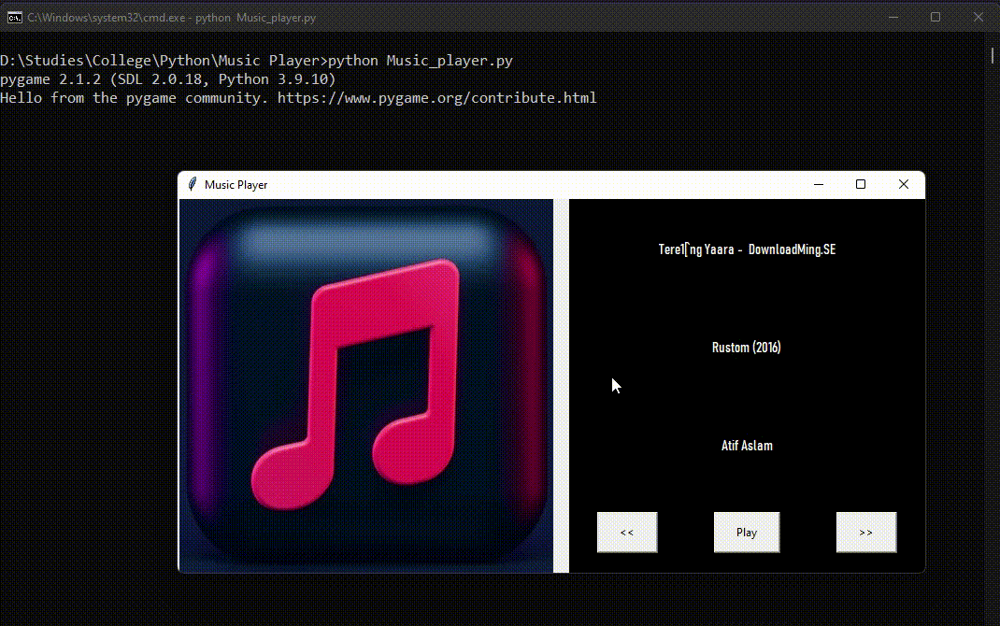
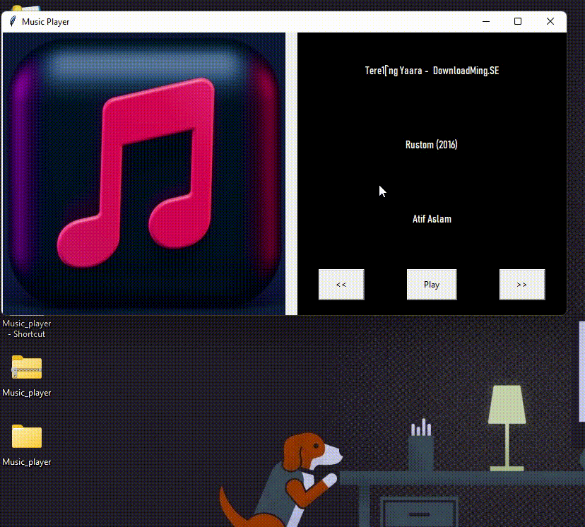
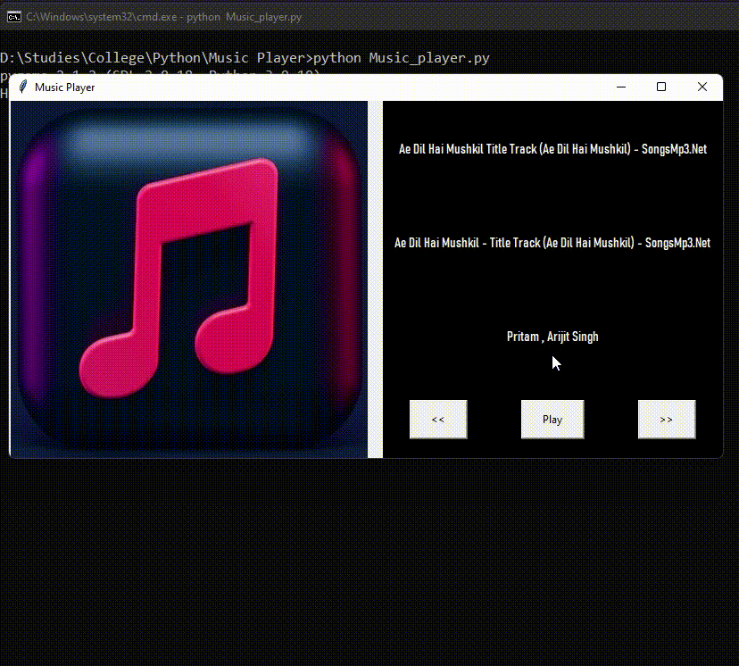

# Music Player - Python

A `Music Player` application that allows you to listen to music stored on your computer's internal or external memory.



## Demo - Using My Music Player

### 1. Install Dependencies
- First, ensure you have Python installed. You can download it [here](https://www.python.org/ftp/python/3.11.1/python-3.11.1-amd64.exe).

- Then, install the required dependencies:

    ```
    pip install -r requirements.txt
    ```

### 2. Run the `Music_player.py` File
- Open your command line and run:

    ```
    python Music_player.py
    ```

### 3. Demonstration

- Upon successful launch, the application will look like this:


- A pop-up will appear for first-time users to choose a folder containing at least one `.mp3` or `.wav` file. Don't skip this step.



- Once the folder is selected, you can access the music player interface. Here, you can `play`, `pause`, and change tracks using the <button>>></button> and <button><<</button> buttons.



- To change the music folder, click on the image (this is a hidden setting).



- Adjust the volume by scrolling the mouse wheel: scroll forward to `increase` volume, and scroll backward to `decrease` volume.



Enjoy your music!
